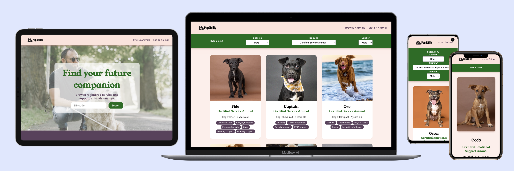

# PupAbility: Service Animal Adoption App

**Marketplace to connect service animals with those in need**

Our team built this app in 36 hours as a submission for [Hacks for Humanity 2023](https://www.hacksforhumanity.io/), where it took 2nd place. I worked as the sole app developer in a five-person multi-disciplinary team.

- **Live demo:** [https://stephengroe.github.io/service-animal-adoption/](https://stephengroe.github.io/service-animal-adoption/)
- **Built with:** Vanilla JS, HTML5, CSS3, Webpack
- **License:** GPL-3.0

## Features

### View and sort service animals

You can view all available animals and sort them by several characteristics. Sorting happens live, and state is saved during the session.

### See trainer connections

Service animals are related to a trainer, letting you see details on the trainer associated with the animal and their process and certifications.

### Select service animals by ZIP code

The app integrates with the Zipcodebase API to fetch nearby ZIP codes. That data is stored and displayed. (It's not included in the current sorting, due to limited sample data.)

## Improvements

Because this demo was built in a single weekend, it needs several upgrades to function as a minimum viable product. Here are the most important:

* **Database integration.** Right now, all demo data is stored locally. It needs a backend integration to maintain products across visitors.

* **Framework upgrade.** The current app is built with Vanilla JS, but for maximum flexibility should be adapted into a scalable frontend solution like React.

* **Messaging capabilities.** Right now, there's no way to communicate with trainers on the platform. This is a critical feature to make this app viable!

* **Trainer details.** I'd like to add additional details on trainer information, including a page for each trainer and a listing of their registered service animals.

* **ZIP sorting.** ZIP code sorting hasn't been implemented. Since since there are only a handful of demo animals, nearly all searches would return zero results! Nearby ZIP codes are collected, but aren't included in a search feature yet.

## Acknowledgements

Special thanks to the rest of our Hacks for Humanity team: Stephanie Bucklin, Eric Covino, Anved Puri, and Bryan Rojas. Thanks also to our mentors during the hackathon.

And of course, the organizers and sponsors of the hackathon who made it all possible!
